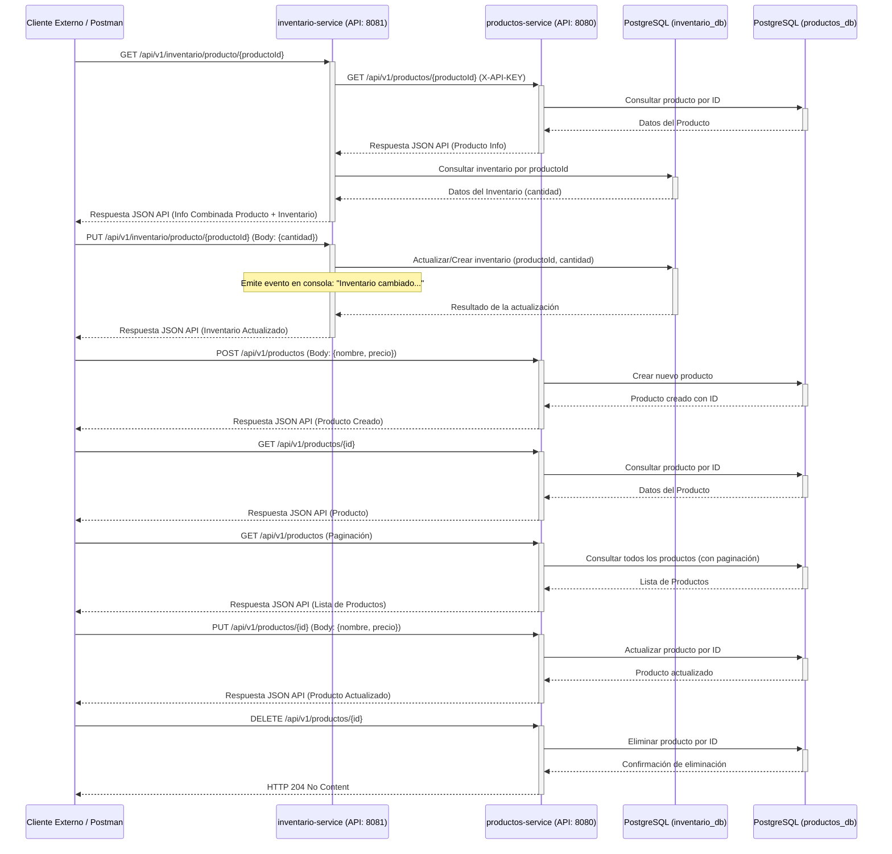

# Prueba Técnica Backend: Microservicios Productos e Inventario

Solución a la prueba técnica para crear dos microservicios independientes (Productos e Inventario) que interactúan entre sí, utilizando JSON API como estándar para la comunicación y Docker para la containerización.

## Requisitos Previos

* Java 21 (o superior)
* Maven 3.x (o Gradle)
* Docker y Docker Compose
* Git

## Arquitectura y Diseño

La solución implementa dos microservicios Spring Boot:

1.  **Microservicio de Productos (`productos-service`):**
    * Puerto: `8080`
    * Responsabilidades: Gestiona el recurso `productos` con los campos `id`, `nombre` y `precio`.
    * Operaciones:
        * Crear un nuevo producto.
        * Obtener un producto específico por ID.
        * Actualizar un producto por ID.
        * Eliminar un producto por ID.
        * Listar todos los productos con paginación simple.
    * Base de Datos: Utiliza la base de datos `productos_db` en PostgreSQL.

2.  **Microservicio de Inventario (`inventario-service`):**
    * Puerto: `8081`
    * Responsabilidades: Gestiona el recurso `inventarios` con los campos `producto_id` y `cantidad`.
    * Operaciones:
        * Consultar la cantidad disponible de un producto específico por ID (obtiene la información del producto llamando al microservicio de productos).
        * Actualizar la cantidad disponible de un producto específico.
        * Emitir un evento simple (mensaje en consola) cuando el inventario cambia.
    * Base de Datos: Utiliza la base de datos `inventario_db` en PostgreSQL.

### Comunicación entre Microservicios

* La comunicación desde `inventario-service` hacia `productos-service` se realiza mediante peticiones HTTP REST.
* Se utiliza `RestTemplate` configurado con timeouts básicos (5 segundos para conexión y lectura).
* **Autenticación:** Se implementa un mecanismo básico de API Keys.
    * `inventario-service` envía una cabecera `X-API-KEY` en sus peticiones a `productos-service`.
    * La API Key se configura mediante la variable de entorno `PRODUCT_SERVICE_API_KEY` para `inventario-service` (ver `docker-compose.yml` y el archivo `application.properties` de `inventario-service` donde se define `product-service.api-key`).
    * **Pendiente por tiempo:** La validación de esta API Key en `productos-service` no fue implementada.

### Estándar JSON API

* Todas las respuestas de ambos microservicios se adhieren al estándar JSON API (https://jsonapi.org/).

## Decisiones Técnicas y Justificaciones

* **Lenguaje y Framework**: Java 21 con Spring Boot, por su robustez, ecosistema para microservicios y por ser el lenguaje de la vacante.
* **Base de Datos**: PostgreSQL.
    * **Justificación**: Se eligió PostgreSQL por su fiabilidad, conjunto de características y familiaridad. Cada microservicio opera contra su propia base de datos (`productos_db`, `inventario_db`) para promover el desacoplamiento, aunque para esta prueba se ejecutan en la misma instancia de PostgreSQL gestionada por Docker Compose. Las tablas son creadas/actualizadas por Hibernate (`ddl-auto=update`) al arrancar los servicios.
* **Containerización**: Docker para cada servicio y Docker Compose para la orquestación del entorno completo (servicios y base de datos).
* **Documentación de API**: Swagger/OpenAPI para cada microservicio.
* **Pruebas**:
    * **Pendiente por tiempo**: La implementación de pruebas unitarias y de integración no se completó debido a la restricción de tiempo. Se priorizó la funcionalidad principal y la configuración del entorno.

## Diagrama de Interacción de Servicios



## Instrucciones de Instalación y Ejecución

1.  **Clonar el repositorio:**
    ```bash
    git clone [https://github.com/SebastianBC09/Microservices-Java.git](https://github.com/SebastianBC09/Microservices-Java.git)
    cd Microservices-Java
    ```

2.  **Construir los JARs de los microservicios:**
    Es necesario empaquetar cada aplicación Spring Boot en un archivo JAR.
    ```bash
    # Para productos-service
    cd productos-service
    mvn clean package
    cd ..

    # Para inventario-service
    cd inventario-service
    mvn clean package
    cd ..
    ```

3.  **Levantar los servicios y la base de datos con Docker Compose:**
    Desde la raíz del repositorio (donde se encuentra `docker-compose.yml`):
    ```bash
    docker-compose up --build
    ```
    Esto construirá las imágenes Docker para cada servicio (si no existen o si los Dockerfile cambiaron) y levantará los contenedores para `productos-service`, `inventario-service`, y `postgres-db`.

4.  **Acceder a los servicios:**
    * **Productos Service:**
        * API base: `http://localhost:8080/api/v1/productos`
        * Swagger UI: `http://localhost:8080/api/v1/productos/swagger-ui.html` (Configurado en `application.properties`)
    * **Inventario Service:**
        * API base: `http://localhost:8081/api/v1/inventario`
        * Swagger UI: `http://localhost:8081/api/v1/inventario/swagger-ui.html` (Configurado en `application.properties`)
    * **Base de Datos (PostgreSQL vía Docker Compose):**
        * Host para acceso externo (ej: pgAdmin): `localhost`
        * Puerto: `5432`
        * Usuario: `usuario_prueba` (Configurado en `docker-compose.yml` y `application.properties`)
        * Contraseña: `Colombia2025!` (Configurado en `docker-compose.yml` y `application.properties`)
        * Bases de datos: `productos_db`, `inventario_db`

## Uso de Git

Se ha intentado mantener un historial de commits descriptivos, agrupando los cambios por funcionalidad o capa dentro de cada microservicio.

## Consideraciones Finales y Mejoras Futuras

* Implementar la validación de la API Key en `productos-service`.
* Completar la cobertura de pruebas unitarias e integración para ambos servicios.
* Implementar un manejo de errores global y más detallado (ej: usando `@ControllerAdvice`) para devolver errores en formato JSON API consistente.
* Considerar el uso de Resilience4j para patrones de resiliencia más avanzados (reintentos, circuit breaker) en la comunicación entre servicios (la estructura base para reintentos está en `ProductServiceClient`).
* Implementar logs estructurados y health checks más específicos para cada servicio.
* Para un entorno de producción, se utilizarían herramientas de migración de base de datos como Flyway o Liquibase en lugar de `ddl-auto=update`.
